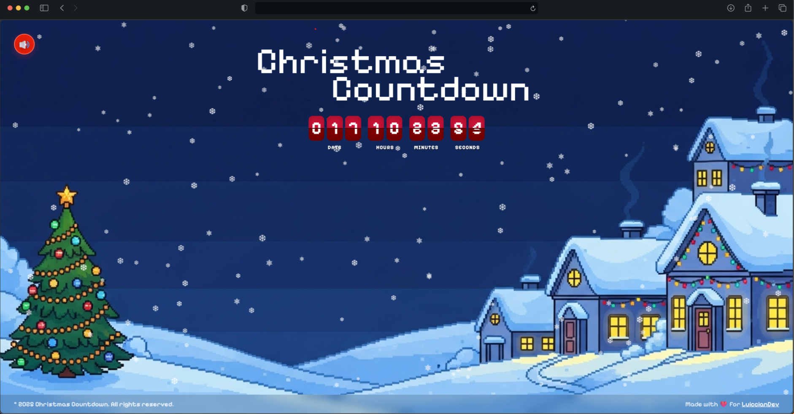

# Christmas Countdown ⏰🎄

Una página web interactiva con cuenta regresiva para Navidad, con efectos de nieve y música de fondo.



## Características

- ⏰ Cuenta regresiva en tiempo real hasta Navidad
- ❄️ Efecto de nieve animado
- 🎵 Música de fondo navideña con control de reproducción
- 📱 Diseño responsive para todos los dispositivos
- 🎨 Interfaz moderna con fuente pixel art

## Tecnologías

- TypeScript
- Vite
- CSS3
- HTML5 Canvas 2D
- HTML5 Audio API

## Instalación

```bash
# Instalar dependencias
pnpm install

# Ejecutar en desarrollo
pnpm dev

# Compilar para producción
pnpm build
```

## Música

La música de fondo utilizada en este proyecto proviene de [Pixabay](https://pixabay.com/music/), una plataforma de contenido libre de derechos de autor.

Para agregar tu propia música:
1. Descarga música navideña de [Pixabay Music](https://pixabay.com/music/)
2. Guarda el archivo como `christmas-music.mp3` en la carpeta `public/`
3. La música se reproducirá automáticamente con el control en la esquina superior izquierda

## Créditos

- Música: [Pixabay](https://pixabay.com/music/) - Libre de derechos de autor
- Desarrollado con ❤️ por [LuiccianDev](https://github.com/LuiccianDev)

## Licencia

Este proyecto es de código abierto y está disponible bajo la licencia MIT.
